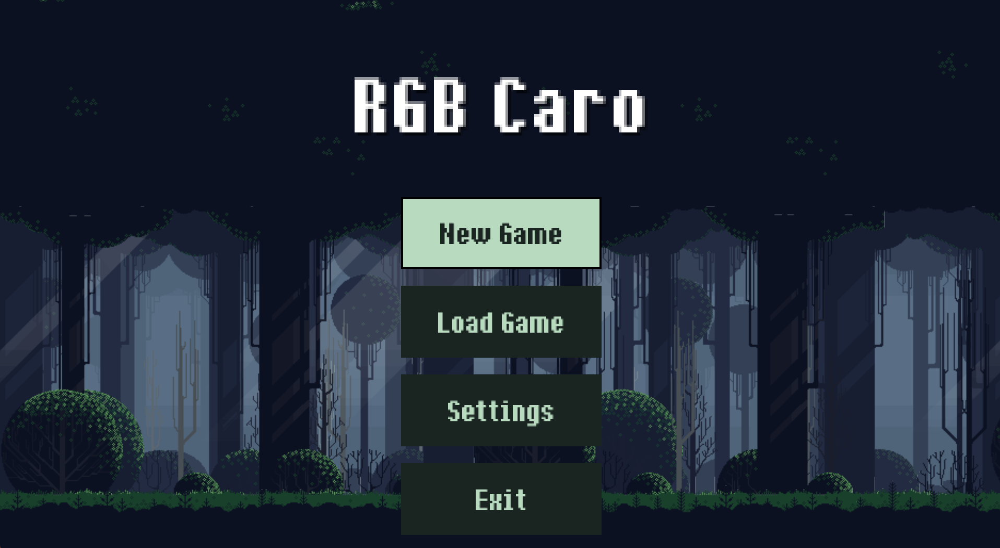
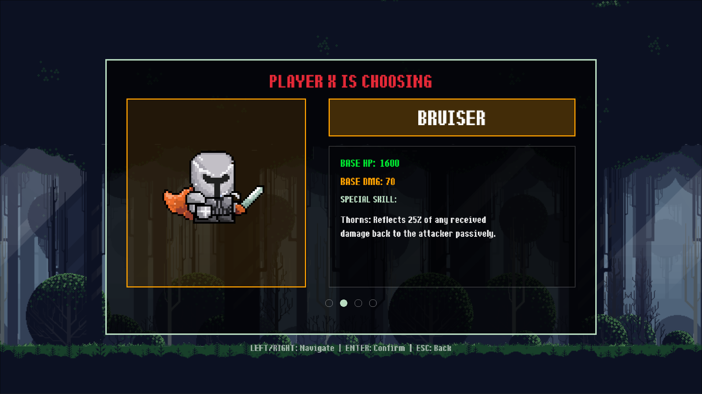
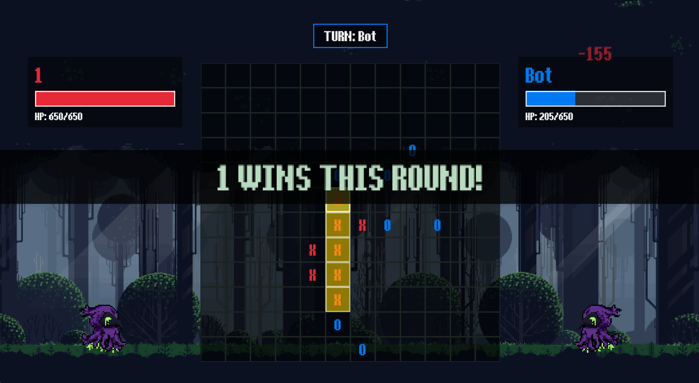
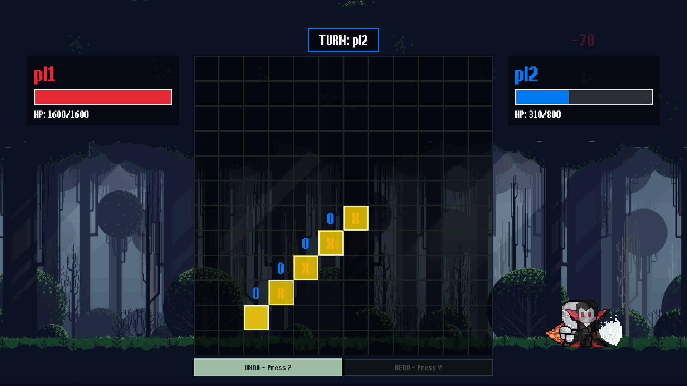

<div align="center">
  <!--  -->
  
  # ⚔️⭕❌ RGBCaro
  
  *A unique tactical twist on the classic Caro (Gomoku) game, developed in C++ using the Raylib library. RGBCaro combines traditional board game logic with RPG-style combat mechanics!*

  <br />
</div>

## 📸 Screenshots

<div align="center">
  <table>
    <tr>
      <td><br/><center><b>Main Menu</b></center></td>
      <td><br/><center><b>Character Selection</b></center></td>
    </tr>
    <tr>
      <td><br/><center><b>Intense Match</b></center></td>
      <td><br/><center><b>Dynamic Combat Animations</b></center></td>
    </tr>
  </table>
</div>

## ✨ Features

* **Combat Caro:** Getting 5 in a row is only half the battle. Winning a single Caro round allows your character to launch a powerful attack on the opponent.
* **Character-Driven Stats:** Choose from 4 distinct character classes (Assassin, Bruiser, Vampire, Sorcerer). The damage dealt and received during an attack is heavily influenced by the unique properties and stats of the chosen characters.
* **HP-Based Matches:** A full match spans across multiple Caro rounds. The game only ends when one player's HP drops to zero. Fight for your survival!
* **Versatile Game Modes:** Duel locally with a friend (PvP) or challenge the built-in Bot AI (PvE).
* **Rich Animations:** Custom-built Sprite Manager powering fluid Idle and 9-step Attack animations, complete with combat effects and screen shake.
* **Audio & State Management:** Integrated background music, sound effects, and the ability to save/load your match progress at any time.
* **Clean Architecture:** Codebase is structured firmly upon the MVC (Model-View-Controller) design pattern.

## 🛠️ Requirements

Before building the game, ensure you have the following dependencies installed on your system:

- **C++ Compiler:** `g++` (Linux/macOS) or MSVC (Windows)
- **Raylib:** A simple and easy-to-use library to enjoy videogames programming.

## 🚀 Build and Execute

### 🪟 Windows (Visual Studio)

The repository includes Visual Studio project files for a seamless build experience.

1. Open `RGBCaro.slnx` (or `RGBCaro.vcxproj`) as a solution with Visual Studio.
2. The NuGet package manager will automatically resolve and install the required packages (e.g., `raylib`).
3. Set your build configuration to **Release** or **Debug**.
4. Press `F5` or click **Local Windows Debugger** to build and execute the game.

### 🐧 Linux (Manual Build via g++)

**Prerequisites Installation:**
Ensure you have the build essentials and Raylib installed. On Ubuntu/Debian, you can install the dependencies via:
```bash
sudo apt update
sudo apt install build-essential git
sudo apt install libasound2-dev mesa-common-dev libx11-dev libxrandr-dev libxi-dev xorg-dev libgl1-mesa-dev libglu1-mesa-dev
```
*(Note: You need to install [raylib](https://github.com/raysan5/raylib) globally or have it available in your system library path).*

**Build Instructions:**

1. Create an output directory:
   ```bash
   mkdir -p out
   ```
2. Compile the source code using `g++`:
   ```bash
   g++ src/*.cpp -o ./out/RGBCaro -lraylib -lGL -lm -lpthread -ldl -lrt -lX11
   ```
3. Run the executable:
   ```bash
   ./out/RGBCaro
   ```

## 🎮 How to Play

1. **Select Game Mode:** Choose between playing against a friend or the AI.
2. **Pick Your Character:** Each player selects a character class. Pay attention to their unique stats!
3. **Play Caro:** Take turns placing `X` and `O` on the grid. Try to get an unbroken row of 5 pieces horizontally, vertically, or diagonally.
4. **Attack:** The player who gets 5 in a row wins the round and deals damage to the opponent based on their character's stats.
5. **Win the Match:** Deplete your opponent's HP to 0 to emerge victorious!

## 🏗️ Architecture

The game follows a strict **Model-View-Controller (MVC)** architectural pattern:
- **Model (`model.cpp`):** Manages game logic, board state, character stats, and HP.
- **View (`view.cpp`, `sprite_manager.cpp`):** Handles rendering, UI drawing, animations, and sound via Raylib.
- **Controller (`controller.cpp`, `bot_ai.cpp`):** Processes user input, coordinates between Model and View, and handles AI decision making.

---

<div align="center">
  <i>Developed with ❤️ for C++ and Raylib.</i>
</div>
